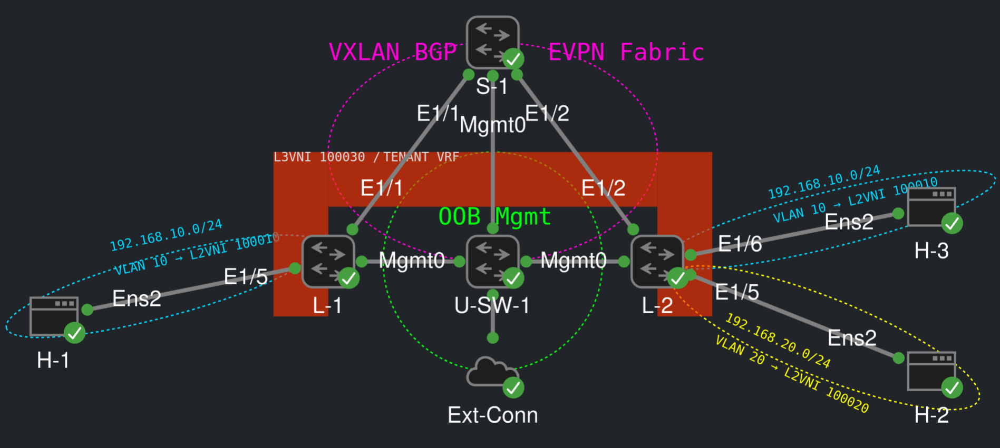

# VXLAN BGP EVPN Infrastructure as Code

This project demonstrates an Infrastructure as Code (IaC) approach to deploying and validating a Cisco Nexus VXLAN BGP EVPN fabric using Ansible and GitHub.

The project is designed around a GitHub-based source of truth, modular configuration roles, automated validation, controlled changes, and repeatable deployments.

## Goals

- Establish GitHub as the authoritative source of truth.
- Replace manual, device-by-device configuration with repeatable automation.
- Eliminate configuration drift and snowflake devices.
- Make infrastructure changes incremental, reviewable, testable, and reversible.
- Separate configuration implementation from validation and compliance.
- Use Ansible roles to provide modular, reusable automation.
- Use GitHub Actions for repository and Ansible validation.
- Preserve idempotency so repeated deployments converge without unnecessary changes.
- Demonstrate a production-oriented NetDevOps workflow that can be extended beyond the lab environment.

---

## Current Environment

The reference environment consists of:

- **S-1** — Nexus 9000v spine / BGP EVPN route reflector
- **L-1** — Nexus 9000v leaf / VXLAN VTEP
- **L-2** — Nexus 9000v leaf / VXLAN VTEP
- **H-1** — Ubuntu endpoint attached to L-1, VLAN 10
- **H-2** — Ubuntu endpoint attached to L-2, VLAN 20
- **H-3** — Ubuntu endpoint attached to L-2, VLAN 10

- NX-OS version 10.6(2)
- Ubuntu version 24.04.4 LTS

## Topology



## Lab

The CML lab provides the development environment used to exercise the automation for this project. The infrastructure definition maintained by Ansible remains separate from the CML lab definition.

The reference CML lab is provided in:

```text
cml/vxlan-bgp-evpn-dev-lab.yml
```

Import that file into CML to start testing.

The topology contains:

-  Three Cisco Nexus 9000v nodes
  -  S-1
  -  L-1
  -  L-2
-  Three Ubuntu endpoint nodes
  -  H-1
  -  H-2
  -  H-3
-  An unmanaged management switch
-  An external connector

The endpoint attachments are:

```text
H-1 -> L-1 Ethernet1/5 -> VLAN 10
H-2 -> L-2 Ethernet1/5 -> VLAN 20
H-3 -> L-2 Ethernet1/6 -> VLAN 10
```

The CML lab definition describes the development environment and physical/logical lab connectivity.

It is intentionally separate from `data/topology.yml`, which describes the infrastructure topology consumed by the Ansible automation.

The external connector is environment-dependent and may require adjustment for a particular CML installation.

The Ubuntu endpoint credentials in the reference lab are intentionally simple and are suitable only for a disposable development environment.

---

## Architecture

The fabric uses:

-  Cisco Nexus 9000v
-  VXLAN
-  MP-BGP EVPN
-  OSPF
-  PIM-SM with BIDIR-PIM
-  Route reflection
-  VLAN-based Layer 2 VNIs
-  Symmetric IRB
-  Anycast gateway
-  Tenant VRF
-  Layer 3 VNI
-  Dedicated loopbacks for underlay identity
-  Dedicated loopbacks for VTEP/NVE source
-  IP unnumbered fabric links
-  MTU size of 9216 bytes on fabric links

### Routing

The underlay uses:

-  OSPF area 0
-  Loopback0 for router identity
-  S-1 as the multicast rendezvous point

The overlay uses:

-  BGP AS 65001
-  iBGP between the fabric nodes
-  S-1 as the BGP EVPN route reflector
-  L-1 and L-2 as route-reflector clients
-  L2VPN EVPN address family
-  Standard and extended BGP communities

### Tenant

The reference tenant uses:

-  VRF: `TENANT`
-  L3VNI: `100030`
-  Shared L3VNI VLAN: `30`
-  Anycast gateway MAC: `0000.1234.5678`

The reference L2VNIs are:

| VLAN           | VNI    | Purpose                 |
| -------------- | ------ | ----------------------- |
| 10             | 100010 | Tenant endpoint network |
| 20             | 100020 | Tenant endpoint network |

---

## Repository Architecture

The project is organized into incremental configuration sections:

```text
00_features
01_underlay
02_overlay_l2
03_overlay_l3
04_vpc
05_multisite
06_endpoints
```

### Section 00 — Features

Enables the required NX-OS features used by the fabric.

Examples include:

-  OSPF
-  PIM
-  BGP
-  NV Overlay EVPN
-  VLAN-based VNI support
-  Fabric forwarding
-  SVI support

Optional features are modeled separately.

### Section 01 — Underlay and Control Plane

Implements:

-  Loopbacks
-  Fabric interfaces
-  MTU
-  IP unnumbered
-  OSPF
-  PIM
-  Bidirectional PIM
-  Multicast RP
-  BGP
-  L2VPN EVPN address family with extended communities
-  Route reflection

This section intentionally does **not** configure VNIs, SVIs, tenant VRFs, or endpoint access ports.

### Section 02 — Layer 2 Overlay

Implements:

-  VLANs
-  VLAN-to-VNI mappings
-  EVPN L2VNIs
-  NVE L2VNI membership

The shared L3VNI VLAN is intentionally excluded from this section and is owned by Section 03.

### Section 03 — Layer 3 Overlay

Implements:

-  Tenant VRF
-  L3VNI
-  EVPN route targets
-  Shared L3VNI VLAN
-  L3VNI SVI
-  Tenant SVIs
-  Anycast gateway
-  NVE L3VNI membership
-  Tenant route redistribution

### Section 04 — vPC

Reserved for future development.

vPC is not required by the current reference topology.

### Section 05 — Multisite

Reserved for future development.

Multisite is not required by the current reference topology.

### Section 06 — Endpoints

Provides automation for dynamic endpoint attachment.

Endpoint configuration is intentionally separated from the core fabric and overlay configuration because endpoint connections are dynamic operational attachments rather than inherent properties of the VXLAN fabric itself.

---

## Source of Truth

The intended infrastructure source of truth is contained under `data/`.

Important files include:

```text
data/
├── devices.yml
├── fabric.yml
├── overlay.yml
├── policies.yml
├── standards.yml
└── topology.yml
```

These files describe the intended state of the fabric.

The Ansible roles consume this data rather than embedding device-specific configuration throughout the automation.

### Topology model

The fabric topology is modeled explicitly in `data/topology.yml`.

Fabric links define both ends of the connection, including:

-  local device
-  local interface
-  remote device
-  remote interface

This allows the automation to configure the correct interface on each participating device while maintaining a single topology definition.

---

## Bootstrap Boundary

This repository intentionally does not automate the initial management-plane bootstrap.

Before running the automation, the target devices must already provide:

-  Management IP connectivity
-  SSH access
-  Valid credentials
-  Reachability from a machine running Ansible

Once those prerequisites exist, Ansible manages the intended fabric configuration.

This establishes a clear boundary between initial device provisioning and infrastructure configuration management.

---

## Inventory and Credentials

A local inventory is required for deployment.

The public repository provides an example:

```text
inventory/
├── examples/
│   └── vault_example.yml
└── hosts_example.yml
```

The actual local inventory and credential files are intentionally excluded from Git.

For example, a local development environment may contain:

```text
inventory/
├── hosts.yml
└── group_vars/
    └── all/
        └── vault.yml
```

The local `vault.yml` contains environment-specific credentials and must not be committed.

The public vault example is stored under `inventory/examples/` rather than `inventory/group_vars/` so that Ansible does not automatically load the example file as inventory variables.

---

## Ansible Vault

Sensitive credentials should be stored using Ansible Vault.

The repository should contain only the example/template file:

```text
inventory/examples/vault_example.yml
```

The actual encrypted vault file remains local and is ignored by Git.

A local vault password file can also be stored outside the repository and referenced by the local Ansible configuration.

Never commit:

-  Production credentials
-  CML credentials
-  Ansible Vault passwords
-  Local inventory files containing credentials
-  Environment-specific secrets

If credentials are ever accidentally committed, they should be considered compromised and rotated even after the offending file is removed.

---

## Deployment

The configuration is deployed incrementally in sections.

### Section 00

```text
ansible-playbook playbooks/deploy_features.yml
```

### Section 01

```text
ansible-playbook playbooks/deploy_underlay.yml
```

### Section 02

```text
ansible-playbook playbooks/deploy_overlay_l2.yml
```

### Section 03

```text
ansible-playbook playbooks/deploy_overlay_l3.yml
```

### Section 04

Not in the current scope.

### Section 05

Not in the current scope.

### Section 06

```text
ansible-playbook playbooks/deploy_endpoints.yml
```

The deployment playbooks save the resulting running configuration to startup configuration after successful deployment.

---

## Validation

Validation is intentionally separated from configuration implementation.

Each major section has an independent validation playbook.

### Section 00

```text
ansible-playbook tests/validation/validate_features.yml
```

### Section 01

```text
ansible-playbook tests/validation/validate_underlay.yml
```

### Section 02

```text
ansible-playbook tests/validation/validate_overlay_l2.yml
```

### Section 03

```text
ansible-playbook tests/validation/validate_overlay_l3.yml
```

### Section 04

Not in the current scope.

### Section 05

Not in the current scope.

### Section 06

```text
ansible-playbook tests/validation/validate_endpoints.yml
```

Validation checks the resulting device state against the intended source of truth and expected operational behavior.

---

## Idempotency

Idempotency is a core requirement of the project.

After the intended configuration has been deployed, running the same deployment again should result in no unnecessary configuration changes.

A typical validation cycle is:

1.  Deploy the configuration.
2.  Validate the resulting state.
3.  Run the same deployment again.
4.  Confirm that no additional changes are required.

This provides confidence that the automation converges on the intended state rather than continually modifying the devices.

---

## Greenfield Testing

The reference environment has also been tested from a clean device state.

The greenfield workflow is:

```text
Clean / reset lab
      |
      v
Bootstrap management / SSH
      |
      v
Deploy Section 00
      |
      v
Deploy Section 01
      |
      v
Deploy Section 02
      |
      v
Deploy Section 03
      |
      v
Deploy Section 06
      |
      v
Validate each section
      |
      v
Repeat deployment
      |
      v
Confirm idempotency
```

The development CML environment referenced in this repository has been used to verify deployment, validation, and repeat-deployment behavior across the entire topology.

---

## CI / GitHub Workflow

GitHub is the authoritative source of truth for the repository.

Changes are intended to follow this workflow:

```text
Feature / Fix Branch
        |
        v
Commit Changes
        |
        v
Push Branch
        |
        v
Pull Request
        |
        v
GitHub Actions Validation
        |
        v
Human Review
        |
        v
Merge to main
```

GitHub Actions validates the repository and Ansible configuration.

The CI workflow does not create, start, or otherwise manage the CML environment.

The CML environment is treated as the development/test platform, while GitHub remains the authoritative source for the automation and infrastructure intent.

---

## Repository Structure

```text
vxlan-evpn-iac/

├── .github/
│   └── workflows/
│       └── ci.yml
│
├── cml/
│   └── vxlan-bgp-evpn-dev-lab.yaml
│
├── data/
│   ├── devices.yml
│   ├── fabric.yml
│   ├── overlay.yml
│   ├── policies.yml
│   ├── standards.yml
│   └── topology.yml
│
├── docs/
│   ├── architecture.md
│   ├── change-governance.md
│   ├── standards.md
│   └── vxlan-evpn-topology.png
│
├── inventory/
│   └── examples/
│       ├── hosts_example.yml
│       └── vault_example.yml
│
├── playbooks/
│   ├── deploy_endpoints.yml
│   ├── deploy_features.yml
│   ├── deploy_overlay_l2.yml
│   ├── deploy_overlay_l3.yml
│   └── deploy_underlay.yml
│
├── roles/
│   ├── 00_features/
│   │   └── tasks/
│   │       ├── common.yml
│   │       ├── evpn.yml
│   │       ├── leaf.yml
│   │       ├── main.yml
│   │       └── optional.yml
│   │
│   ├── 01_underlay/
│   │   └── tasks/
│   │       ├── bgp.yml
│   │       ├── interfaces.yml
│   │       ├── main.yml
│   │       ├── ospf.yml
│   │       └── pim.yml
│   │
│   ├── 02_overlay_l2/
│   │   └── tasks/
│   │       ├── evpn.yml
│   │       ├── main.yml
│   │       ├── nve.yml
│   │       ├── vlans.yml
│   │       └── vni_mappings.yml
│   │
│   ├── 03_overlay_l3/
│   │   └── tasks/
│   │       ├── anycast_gateway.yml
│   │       ├── l3vni_svi.yml
│   │       ├── main.yml
│   │       ├── nve.yml
│   │       ├── redistribution.yml
│   │       ├── shared_vlan.yml
│   │       ├── vrf_af.yml
│   │       └── vrf.yml
│   │
│   ├── 04_vpc/
│   │   └── .gitkeep
│   │
│   ├── 05_multisite/
│   │   └── .gitkeep
│   │
│   └── 06_endpoints/
│       └── tasks/
│           ├── access_ports.yml
│           ├── interfaces.yml
│           └── main.yml
│
├── tests/
│   └── validation/
│       ├── validate_endpoints.yml
│       ├── validate_features.yml
│       ├── validate_overlay_l2.yaml
│       ├── validate_overlay_l3.yml
│       └── validate_underlay.yml
│
├── .gitignore
├── ansible.cfg
├── README.md
├── requirements.txt
├── requirements.yml
└── SECURITY.md
```

---

## Security

This is a public repository.

Do not commit secrets or environment-specific credentials.

The following are intentionally excluded from version control:

-  Local Ansible inventory
-  Encrypted local vault variables
-  Vault password files
-  Environment files
-  Generated artifacts
-  Local reports

The public repository contains templates and examples only.

See `SECURITY.md` for the project's security guidance.

---

## Project Status

The current reference implementation includes:

-  GitHub SSOT
-  Modular Ansible role structure
-  Section 00 feature automation
-  Section 01 underlay and BGP EVPN control plane
-  Section 02 Layer 2 overlay
-  Section 03 Layer 3 overlay
-  Section 06 endpoint attachment automation
-  Separate validation playbooks
-  Idempotent deployment
-  Startup configuration persistence
-  GitHub Actions repository validation through CI workflows
-  Reference CML development lab
-  Greenfield deployment testing
-  Repeat-deployment/idempotency testing

Future sections such as Section 04 - vPC and Section 05 - multisite remain intentionally reserved and are not required for the current reference topology.

---

## License

This project is licensed under the MIT License. See [LICENSE](LICENSE) for the full license text.

---

## Disclaimer

This project is a development and demonstration environment intended to illustrate Infrastructure as Code, NetDevOps, and VXLAN BGP EVPN automation concepts.

The configuration should be reviewed and validated in a test environment before being used in production.
